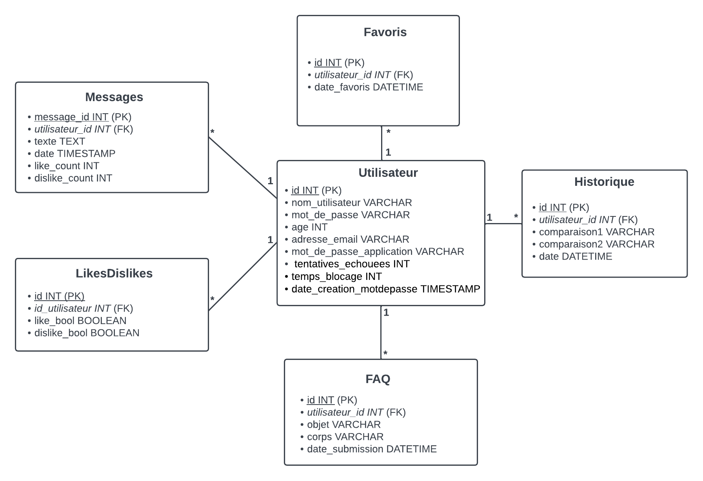

# SAÉ501-502-THEOTIME-MARTEL

## README

# Summary

<!--Source du sommaire : https://github.com/Relex12/Markdown-Table-of-Contents/blob/main/README.md-->

1. [About this projet](#about-this-project)
2. [Application infrastructure](#application-infrastructure)
3. [MCD](#mcd)
4. [Key features](#key-features)
5. [What script to execute to create tables in the database](#what-script-to-execute-to-create-tables-in-the-database)
6. [Where to start](#where-to-start)
7. [How to use the application](#how-to-use-the-application)
8. [Installation of syslog](#installation-of-syslog)
9. [Portainer](#portainer)
10. [Vault Hashicorp](#vault-hashicorp)
11. [Monitoring with Netdata](#monitoring-with-netdata)
12. [How to properly uninstall the application](#how-to-properly-uninstall-the-application)
13. [Improvement notes](#improvement-notes)
14. [License](#license)

### About this project

The SAE501-502 project aimed to create a comparator between two identities based on Wikipedia statistics.

The authors of this projcet are : 

* THÉOTIME Lukas
* DENOYELLE Yohann
* MARTEL Nathan

### Application infrastructure

Here is the application infrastructure diagram : 


The white rectangles representing the containers are "mandatory" containers necessary for the functioning of the application. As for the rectangles of other colors, they are not "mandatory". The user can choose whether or not to implement them.

### MCD

Here is the MCD for the application : 



### Key features

The main features of the project are as follows:

* Creation of new accounts (functional)
* Authentication with username and password (functional)
* Logout/Deauthentication system (functional)
* Storage of users and different comparisons with dates in the database (functional) (functional).
* Option to favorite a comparison based on the user (functional)
* Automatically create tables in the database (functional).
* Log in and save data in the database (functional).
* User-based comparison history (functional).
* Compare two entiites using Wikipedia statistics (functionnal).
* The application provides the user with the option to choose whether or not to download the result of both comparisons. (functional)
* Use the SlimV4 framework with its routes (functional)
* The website is responsive design (functional)
* Pagination of History and Favorites pages (functional)
* The website is available in two languages: French and English (non-functional).
* Website security: Prevention of SQL injections --> Sanitizing PHP (functional)
* Encryption of database information (functional).
* Website security: Implementation of HTTPS to encrypt exchanged data (functional).
* Website security: Security and redondancy mechanism (Load Balancing) to ensure continuous availability (functional).
* Fault tolerance, one maximum fault (functional)
* Adding a superuser with privileged access. This superuser can access all the site's features, including viewing the whole history, all favorites, all users, etc. (functional)
* Settings page where the user can add information to their profile, change/update their password, delete their account, and submit a question to the user support: an email is sent to the site administrators. (functional)
* If the user has forgotten his password (and has previously completed their profile by adding their Gmail address, age, etc.), the application provides a "forgot password" system. After identity verification, the user receives an email with a random generated new password. This new password then becomes the user's updated password, stored in the database. (functional)
* The application administrator can access a private page containing all user questions (support inquiries), and he is the only one who have access to this page. (functional)
* Users can chat with each other and share their comparisons using a chat feature. (functional)
* The logs generated by the application are collected, analyzed and stored using a syslog with syslog-ng + crontab (functional).
* A graphical interface for viewing logs is available via Grafana (functional).
* Password expiration date in the database (functional).
* Master/Slave Database Replication (functional)
* The management of containers is done through Portainer (functional).
* Monitoring a container with Netdata (functional)
* Dark theme or light theme (functional)
* HashiCorp Vault container for storing sensitive data (in progress)
* Token JWT (non-functional)
* Container PHP load balancing (non-functional)
* Script for a clean uninstallation of the application (functional)

### What script to execute to create tables in the database

* What script to run to create tables ?

The creation of the tables in the database is automatic. To do it, we use `mysqli_multi_query`.
Therefore, as soon as a connection is made to the database, by using an .sql script, a $tables variable (which contains the commands for creating tables with an `IF NOT EXISTS`) is launched automatically to create the tables. The sensitive data in the database are hashed and salted.
Furthermore, there is redundancy of this data through master/slave replication.

### Where to start

First, clone the project from the Git repository :
```
git clone https://scm.univ-tours.fr/22107454t/sae501-502-theotime-martel.git
```
Navigate to the project directory : 
```
cd sae501-502-theotime-martel
```
The installation of the application is simple and automated. You just need to run as a superuser with sudo the setup.sh script : 
```
sudo bash setup.sh 
```
Or : 
```
sudo ./setup.sh
```
This will install podman, podman-compose, and the necessary container images for the proper functioning of the application.
Next, when running the script, you will need to choose whether you want to implement a syslog with syslog-ng in the application and, if yes, whether you also want to have a graphical interface to view the logs.
Finally, once your choice regarding the log management part is made and the script execution is complete, an IP address and a port are available. This is the IP address of the application to visit (very rarely different from `https://172.18.0.253:8443`) or `https://yln.fr:8443`.
```
https://yln.fr:8443
```
**Caution** : The entire syslog-ng section, including its operation, is explained in the "Installation of syslog" section.

### How to use the application

Once the setup.sh script is started, open a web browser and enter `https://[IP_Address_Provided_By_The_Script]:8443` or `https://yln.fr:8443` (the PHP and Nginx container provides the user interface). It's not possible to connect with the HTTP protocol, it's automatically redirected to HTTPS. The IP address is the Haproxy container which will distribute the load between two nginx WEB containers. Make sure to add the port. 

**Caution** : You may encounter the following error when attempting to register for the first time on the site: 2002 Error. This means that the MySQL server did not start correctly or is not running. If this error occurs, you need to stop the docker-compose (1) :
```
sudo bash uninstall.sh
```
Choose the act of destroying the images with the script. (2)
Pull manually the image again (3) : 
```
podman pull docker.io/library/mysql:latest
```
Finally restart the setup script (4). The mysql:latest image occasionally experiences some difficulties with our application.

From this page, it is possible to register/login with an account by clicking on the "Login" page in the top right-hand corner of the page. If you register, you will need to log in with the same login credentials.

Once logged in, it is possible to compare two entities by clicking on the "Comparison" page and entering the title of a Wikipedia page, such as "Paris_Saint-Germain_Football_Club" and "Olympique_de_Marseille". You can also add your favorite comparisons by clicking the "Ajouter aux favoris" button and view your favorites on the Favorites page or download it by clicking on the "Telecharger" button.

Additionally, a timestamped comparison history is available on the "History" page. Once all operations are completed, you can log out by clicking the "Logout" button. It is not possible to compare two identities or view the history and favorites without logging in.

Many other features are present in the application, it's up to you to discover them ! 

### Installation of syslog 

The installation of a syslog server and a graphical interface to view logs more clearly (because it's always possible to view syslog-ng logs in the container but without a graphical interface) is optional. If you decide to run the application, which consists of a syslog container you will need a lot of resources.

**Without syslog** : Without syslog, the application works perfectly; it just won't be possible to have centralized logs for the application. It will be composed of 5 containers.

**With syslog without GUI** : With syslog but without a GUI, a syslog-ng container will be added to the application. It will then be composed of 6 containers, and it will be possible to view the application logs by connecting to the syslog-ng container with the command :
```
podman exec -it syslog-ng /bin/bash
```
Then navigating to the `cd /var/log/` floder. A folder named "YLN" should be created with all the logs stored by syslog-ng and by each container inside it. Therefore, there will be log files for all 6 containers (after full use of the application). The advantage of syslog-ng is that logs are sorted by containers.


Furthermore, the advantage of syslog-ng, despite the container being resource-intensive, is that it provides confidentiality, authentication, and data integrity through a crontab configured within the container.

**With a log management interface (GUI)** : With a GUI to exploit the logs, three containers are linked. Promtail will collect the logs, loki will efficiently manage all these logs so that Grafana can visualize the logging data stored in Loki. Therefore, with this configuration, it is possible to visualize logs from a GUI managed by Grafana. The log viewing address is secure (HTTPS) and is as follows: `https://172.18.0.10:3000` or `https://grafana.yln.fr:3000`. Note that it is not possible to connect to it until logs aren't generated and stored in Loki. The advantage of the GUI, despite logs not being sorted, is that it provides an interface that is clearer.

**To use the GUI and configure it** :

Once the logs are generated, go to the Grafana GUI (`https://grafana.yln.fr:3000`). The default username and password are **admin**/**admin**. Grafana will prompt you to change them after the first login.

After successfully logging in to Grafana, you'll need to configure a data source. In the menu at the top left, go to "**Configuration**" > "**Data Sources**" > "**Add data source**". Scroll down a bit and choose the **Loki** data source. In the Connection URL, put `http://172.18.0.8:3100` and click "**Save & Test**" at the bottom of the page. You should see a message "**Data source successfully connected**".

Then, in the menu, go to "**Explore**". In the "**Label**" section, choose "**job = varlogs**". Set "**Line contains**" to **GET** and customize as desired (add a dashboard, schedule, etc.).

Finally, execute by clicking on "Run Query". You can have results like the ones below :


You can also add an existing Dashboard on https://grafana.com/grafana/dashboards/14876-grafana-loki-dashboard-for-istio-service-mesh/

0) After configure the data source...
1) In the menu go to "**Dashboard**" > "**Import a Dashboard**" > "**ID**". With the ID : **14876**
2) Save and go to "**Explore**"

Here is what you can have :


### Portainer

Portainer provides an overall view of the containers in use. Access is granted via HTTPS using the following URL : `https://172.18.0.254:9443` or `https://portainer.yln.fr:9443`
Here is an image of the running containers with Portainer :


### Vault Hashicorp

In Progress...

### Monitoring with Netdata

We've set up a container to monitor the performance of other containers. We successfully deployed the netdata container, which provides a view with numerous graphs and a lot of data. The container requires moderate resources.
Here is what you could have with the netdata container :


### How to properly uninstall the application

We've created a script that allows for the clean removal of the YLN application. To do this, in the directory sae501-502-theotime-martel, there is an uninstall.sh script. Execute it with the following command :
```
sudo bash uninstall.sh 
```
You'll need to answer some questions if you want to remove images from containers, backup volumes, ...

### Improvement notes

* Container PHP load balancing
* Application available in French and English
* Vault hashicorp container
* Token JWT
* PHP Response SLIM

### License

>You can check out the full license [here](LICENSE)

This project is licensed under the terms of the **MIT** license.

<!--
## Getting started

To make it easy for you to get started with GitLab, here's a list of recommended next steps.

Already a pro? Just edit this README.md and make it your own. Want to make it easy? [Use the template at the bottom](#editing-this-readme)!

## Add your files

- [ ] [Create](https://docs.gitlab.com/ee/user/project/repository/web_editor.html#create-a-file) or [upload](https://docs.gitlab.com/ee/user/project/repository/web_editor.html#upload-a-file) files
- [ ] [Add files using the command line](https://docs.gitlab.com/ee/gitlab-basics/add-file.html#add-a-file-using-the-command-line) or push an existing Git repository with the following command:

```
cd existing_repo
git remote add origin https://scm.univ-tours.fr/22107454t/sae501-502-theotime-martel.git
git branch -M main
git push -uf origin main
```

## Integrate with your tools

- [ ] [Set up project integrations](https://scm.univ-tours.fr/22107454t/sae501-502-theotime-martel/-/settings/integrations)

## Collaborate with your team

- [ ] [Invite team members and collaborators](https://docs.gitlab.com/ee/user/project/members/)
- [ ] [Create a new merge request](https://docs.gitlab.com/ee/user/project/merge_requests/creating_merge_requests.html)
- [ ] [Automatically close issues from merge requests](https://docs.gitlab.com/ee/user/project/issues/managing_issues.html#closing-issues-automatically)
- [ ] [Enable merge request approvals](https://docs.gitlab.com/ee/user/project/merge_requests/approvals/)
- [ ] [Automatically merge when pipeline succeeds](https://docs.gitlab.com/ee/user/project/merge_requests/merge_when_pipeline_succeeds.html)

## Test and Deploy

Use the built-in continuous integration in GitLab.

- [ ] [Get started with GitLab CI/CD](https://docs.gitlab.com/ee/ci/quick_start/index.html)
- [ ] [Analyze your code for known vulnerabilities with Static Application Security Testing(SAST)](https://docs.gitlab.com/ee/user/application_security/sast/)
- [ ] [Deploy to Kubernetes, Amazon EC2, or Amazon ECS using Auto Deploy](https://docs.gitlab.com/ee/topics/autodevops/requirements.html)
- [ ] [Use pull-based deployments for improved Kubernetes management](https://docs.gitlab.com/ee/user/clusters/agent/)
- [ ] [Set up protected environments](https://docs.gitlab.com/ee/ci/environments/protected_environments.html)

***

# Editing this README

When you're ready to make this README your own, just edit this file and use the handy template below (or feel free to structure it however you want - this is just a starting point!). Thank you to [makeareadme.com](https://www.makeareadme.com/) for this template.

## Suggestions for a good README
Every project is different, so consider which of these sections apply to yours. The sections used in the template are suggestions for most open source projects. Also keep in mind that while a README can be too long and detailed, too long is better than too short. If you think your README is too long, consider utilizing another form of documentation rather than cutting out information.

## Name
Choose a self-explaining name for your project.

## Description
Let people know what your project can do specifically. Provide context and add a link to any reference visitors might be unfamiliar with. A list of Features or a Background subsection can also be added here. If there are alternatives to your project, this is a good place to list differentiating factors.

## Badges
On some READMEs, you may see small images that convey metadata, such as whether or not all the tests are passing for the project. You can use Shields to add some to your README. Many services also have instructions for adding a badge.

## Visuals
Depending on what you are making, it can be a good idea to include screenshots or even a video (you'll frequently see GIFs rather than actual videos). Tools like ttygif can help, but check out Asciinema for a more sophisticated method.

## Installation
Within a particular ecosystem, there may be a common way of installing things, such as using Yarn, NuGet, or Homebrew. However, consider the possibility that whoever is reading your README is a novice and would like more guidance. Listing specific steps helps remove ambiguity and gets people to using your project as quickly as possible. If it only runs in a specific context like a particular programming language version or operating system or has dependencies that have to be installed manually, also add a Requirements subsection.

## Usage
Use examples liberally, and show the expected output if you can. It's helpful to have inline the smallest example of usage that you can demonstrate, while providing links to more sophisticated examples if they are too long to reasonably include in the README.

## Support
Tell people where they can go to for help. It can be any combination of an issue tracker, a chat room, an email address, etc.

## Roadmap
If you have ideas for releases in the future, it is a good idea to list them in the README.

## Contributing
State if you are open to contributions and what your requirements are for accepting them.

For people who want to make changes to your project, it's helpful to have some documentation on how to get started. Perhaps there is a script that they should run or some environment variables that they need to set. Make these steps explicit. These instructions could also be useful to your future self.

You can also document commands to lint the code or run tests. These steps help to ensure high code quality and reduce the likelihood that the changes inadvertently break something. Having instructions for running tests is especially helpful if it requires external setup, such as starting a Selenium server for testing in a browser.

## Authors and acknowledgment
Show your appreciation to those who have contributed to the project.

## License
For open source projects, say how it is licensed.

## Project status
If you have run out of energy or time for your project, put a note at the top of the README saying that development has slowed down or stopped completely. Someone may choose to fork your project or volunteer to step in as a maintainer or owner, allowing your project to keep going. You can also make an explicit request for maintainers.
-->
